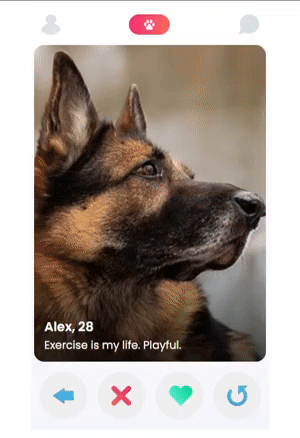

# Tindog
<b>Partial clone of tinder for dogs</b>

## Strech Goals

<b>1. Ability to rewind dogs' profiles</b> :white_check_mark: * 

<b>2. Ability to go to previous dog's profile</b> :white_check_mark: 

-------

*<i>Checkboxes will be checked once a task has been completed.</i>

<i>This project was a solo project that I accomplished by myself. The design idea was given by <a href="https://scrimba.com/">Scrimba</a> from a course project in the Frontend Developer Career Path.</i>
